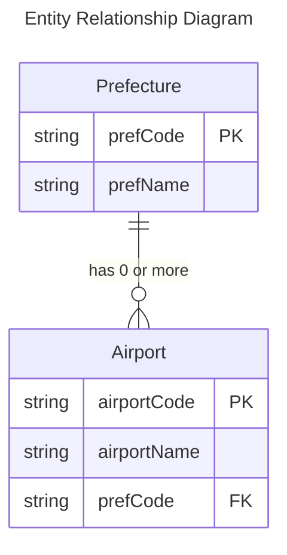

[](https://github.com/SUZUKI-Takayuki-0404/Kadai10th/actions/workflows/kadai10thtest.yml)

[](https://codecov.io/gh/SUZUKI-Takayuki-0404/Kadai10th)

# 第10回課題

最終課題は本課題の成果物をベースに作成予定

## 1. アプリケーション概要

- 取扱データテーブルに対するCRUD処理すべてを備えたREST API

- アプリケーション概略図
  
  

- JUnitによるテストコード実装
- CIの実装
    - [Checkstyle](https://github.com/raisetech-for-student/checkstyle-hands-on)
    
      
      
       - reviewdog指摘事項の例：入力規則に違反していたパッケージ名を修正
         - [Befrore](http://htmlpreview.github.io/?https://github.com/SUZUKI-Takayuki-0404/Kadai10th/blob/Update/PackageName/main_before.html)
         - [After](http://htmlpreview.github.io/?https://github.com/SUZUKI-Takayuki-0404/Kadai10th/blob/Update/PackageName/main_after.html)
      
    - [Codecov](https://github.com/codecov/example-java-gradle)

      
      
      
      
    - [テストレポート可視化(action-junit-report)](https://github.com/mikepenz/action-junit-report)
      
      
            
    - [SpotBugs](https://github.com/spotbugs/spotbugs-gradle-plugin)
    
    - [Slack Integration](https://github.blog/changelog/2022-12-06-github-actions-workflow-notifications-in-slack-and-microsoft-teams/)
      
      

    - [Actions Status Discord](https://github.com/sarisia/actions-status-discord)

      SlackからDiscordへのチャットツール移行に伴い追加
      
      


- GitHub Actionsによる自動単体テスト
  
    - [自動テストコード](https://github.com/SUZUKI-Takayuki-0404/Kadai10th/blob/main/.github/workflows/kadai10thtest.yml)
    
    - [実行結果の例](https://github.com/SUZUKI-Takayuki-0404/Kadai10th/actions/runs/4274337865/jobs/7440876285)
  

## 2. 取扱データテーブル

#### 都道府県コード表

[都道府県コード](https://github.com/SUZUKI-Takayuki-0404/Kadai10th/blob/main/sql/table-prefecture.sql)


※01～09を使用の為、都道府県コードは文字列として定義

#### 空港コード表

[空港コード](https://github.com/SUZUKI-Takayuki-0404/Kadai10th/blob/main/sql/table-airport.sql)


#### データテーブルのER図



#### 関連処置：日本語の文字化け対策

- 文字化けの例

  

- 処置（文字エンコード指定）

  


## 3. 各クラスの実装メソッド/単体Testメソッド確認事項一覧

### Mapperクラス

<details>
<summary>実装済み</summary>

#### Prefectures

|Method<br>`type name(arguments)`|Function<br>`実行SQLコマンド`|Testメソッド確認事項|
|--|--|--|
|`Optional<PrefectureEntity>`<br>`selectPrefByCode(String prefCode)`|指定した都道府県コードに対応する都道府県データを取得する<br>`SELECT * FROM prefectures`<br>`WHERE prefCode = #{prefCode}`|<ul><li>都道府県があるときは取得できること</li><li>都道府県が無いときは空として返すこと</li></ul>|
|`Optional<PrefectureEntity>`<br>`selectPrefByName(String prefName)`|指定した都道府県名に対応する都道府県データを取得する<br>`SELECT * FROM prefectures`<br>`WHERE prefName = #{prefName}`|<ul><li>都道府県があるときは取得できること</li><li>都道府県名が無いときは空として返すこと</li></ul>|
|`List<PrefectureEntity> selectAllPrefs()`|全ての都道府県データを取得する<br>`SELECT * FROM prefectures`|<ul><li>登録済みの都道府県がある場合は全て取得できること</li><li>都道府県データが無いときは空として返すこと</li></ul>|
|`void insertPref`<br>`(String prefCode, String prefName)`|既存と重複しない都道府県データを挿入する<br>`INSERT INTO prefectures (prefCode, prefName)`<br>`VALUES (#{prefCode}, #{prefName})`|<ul><li>都道府県コードが既存のものと重複しない場合は登録できること</li><li>都道府県コードが既存のものと重複する場合は、DuplicateKeyExceptionをスローすること</li></ul>|
|`boolean updatePref`<br>`(String prefCode, String prefName)`|指定した都道府県コードに対応する都道府県データを更新する<br>`UPDATE prefectures `<br>`SET prefName = #{prefName}`<br>`WHERE prefCode = #{prefCode}`|<ul><li>都道府県があるときは名前を更新できること</li><li>都道府県が無い場合は何しないこと	</li></ul>|
|`boolean deletePref`<br>`(String prefCode)`|指定した都道府県コードに対応する都道府県のデータを削除する<br>`DELETE FROM prefectures`<br>`WHERE prefCode = #{prefCode}`|<ul><li>都道府県がある場合は削除できること</li><li>都道府県が無い場合は何もしないこと</li></ul>|

#### Airports

|Method<br>`type name(arguments)`|Function<br>`実行SQLコマンド`|Testメソッド確認事項|
|--|--|--|
|`Optional<AirportEntity>`<br>`selectAirportByCode(String airportCode)`|空港データと都道府県データとを都道府県コードで結合し、指定した空港コードに該当するデータを取得する<br>`SELECT airports.*, prefectures.prefName`<br>`FROM airports INNER JOIN prefectures`<br>`ON airports.prefCode = prefectures.prefCode`<br>`WHERE airportCode = #{airportCode} `|<ul><li>空港があるときは取得できること</li><li>空港が無いときは空として返すこと</li></ul>|
|`List<AirportEntity> selectAirportsByPrefName`<br>`(String airportName)`|空港データと都道府県データとを都道府県コードで結合し、指定した都道府県名に該当するデータを取得する<br>`SELECT airports.*, prefectures.prefName`<br>`FROM airports INNER JOIN prefectures`<br>`ON airports.prefCode = prefectures.prefCode `<br>`WHERE prefName = #{prefName}`|<ul><li>その都道府県に空港があるときは、全て取得できること</li><li>空港がないときは空として返すこと</li><li>都道府県名が誤っているときは空として返すこと</li></ul>|
|`List<AirportEntity> selectAllAirports()`|空港データと都道府県データとを都道府県コードで結合し、全データを取得する<br>`SELECT airports.*, prefectures.prefName `<br>`FROM airports INNER JOIN prefectures`<br>`ON airports.prefCode = prefectures.prefCode`|<ul><li>登録済みの空港がある場合は全て取得できること</li><li>空港がないときは空として返すこと</li></ul>|
|`void insertAirport`<br>`(String airportCode, String airportName, String prefCode)`|既存と重複しない空港データを挿入する<br>`INSERT INTO airports (airportCode, airportName, prefCode)`<br>`VALUES (#{airportCode}, #{airportName}, #{prefCode})`|<ul><li>空港コードが既存のものと重複しない場合は登録できること</li><li>空港コードが既存のものと重複する場合は、DuplicateKeyExceptionをスローすること</li></ul>|
|`boolean updateAirport`<br>`(String airportCode, String airportName, String prefCode)`|指定した空港コードに対応する空港データを更新する<br>`UPDATE airports `<br>`SET airportName = #{airportName}, prefCode = #{prefCode} `<br>`WHERE airportCode = #{airportCode}`|<ul><li>空港がある場合は空港名を更新すること</li><li>空港が無い場合は何もしないこと</li></ul>|
|`boolean deleteAirport`<br>`(String airportCode)`|指定した空港コードに対応する空港データを削除する<br>`DELETE FROM airports `<br>`WHERE airportCode = #{airportCode}`|<ul><li>都道府県がある場合は削除できること</li><li>都道府県が無い場合は何もしないこと</li></ul>|

</details>

### Serviceクラス

<details>
<summary>実装済み</summary>

#### Prefectures

|Method<br>`type name(arguments)`|Function|Testメソッド確認事項|
|--|--|--|
|`PrefectureEntity getPrefByCode(String prefCode)`|指定の都道府県コードに対応する都道府県データを返す|<ul><li>都道府県コードに対応する都道府県がある場合は取得できること</li><li>指定の都道府県コードに対応する都道府県のEntityが存在しない場合はNoResourceExceptionをスローすること</li></ul>|
|`PrefectureEntity getPrefByName(String prefName)`|指定の都道府県名に対応する都道府県データを返す|<ul><li>都道府県名に対応する都道府県がある場合は取得できること</li><li>指定の都道府県名に対応する都道府県のEntityが無い場合はNoResourceExceptionをスローすること</li></ul>|
|`List<PrefectureEntity> getAllPrefs()`|都道府県データ全てをListとして返す|<ul><li>登録済みの都道府県がある場合はその全てをListで取得できること</li><li>都道府県が無い場合は空のListを返すこと</li></ul>|
|`PrefectureEntity createPref`<br>`(String prefCode, String prefName)`|新規の都道府県コードで都道府県データを登録する|<ul><li>都道府県コードが既存のものと重複しない場合、都道府県を追加できること</li><li>都道府県コードが既存のものと重複する場合はDuplicateCodeExceptionをスローすること</li></ul>|
|`void updatePref`<br>`(String prefCode, String prefName)`|指定の都道府県コードに対応する都道府県データを更新する|<ul><li>都道府県コードに対応する都道府県があり、かつ従前と異なる場合は都道府県名を更新できること</li><li>都道府県コードに対応する都道府県はあるが、都道府県名が従前と同等の場合はSameAsCurrentExceptionをスローすること</li><li>都道府県コードに対応する都道府県が無い場合はNoResourceExceptionをスローすること</li></ul>|
|`void deletePref`<br>`(String prefCode)`|指定の都道府県コードに対応する都道府県データを削除する<br>※削除対象の都道府県コードを付与されている空港がある場合は削除不可|<ul><li>都道府県コードに対応する都道府県があり、かつその都道府県に空港が存在しない場合、都道府県を削除できること</li><li>都道府県コードに対応する都道府県があり、かつその都道府県に空港がある場合、CodeInUseExceptionをスローすること</li><li>都道府県コードに対応する都道府県が無い場合はNoResourceExceptionをスローすること</li></ul>|

#### Airports

|Method<br>`type name(arguments)`|Function|Testメソッド確認事項|
|--|--|--|
|`AirportEntity`<br>`getAirportByCode(String airportCode)`|指定の空港コードに対応する空港データを返す<br>※都道府県コードから都道府県名を取得する|<ul><li>空港コードに対応する空港がある場合は取得できること</li><li>空港コードに対応する空港が無い場合はNoResourceExceptionをスローすること</li></ul>|
|`List<AirportEntity>`<br>`getAirportsByPrefName(String prefName)`|指定の都道府県名に対応する空港データ全てをListとして返す|<ul><li>その都道府県に空港がある場合は全て取得できること</li><li>都道府県に空港が無い場合は空のリストを返すこと</li></ul>|
|`List<AirportEntity>`<br>`getAllAirports()`|空港データ全てをListとして返す<br>※都道府県コードから都道府県名を取得する|<ul><li>登録済みの空港がある場合は全て取得できること</li><li>登録済みの空港が無い場合は空のリストを返すこと</li></ul>|
|`AirportEntity createAirport`<br>`(String airportCode, String airportName, String prefCode)`|新規の空港データを登録する|<ul><li>空港コードが既存のものと重複せず、かつ所在の都道府県がある場合、空港データを追加できること</li><li>空港コードが既存のものと重複する場合はDuplicateCodeExceptionをスローすること</li><li>都道府県コードに対応する都道府県が無い場合はNoResourceExceptionをスローすること</li></ul>|
|`void updateAirport`<br>`(String airportCode, String airportName, String prefCode)`|指定の空港コードに対応する空港データを更新する（都道府県コード変更有無は不問）|<ul><li>空港コードに対応する空港があり、かつ空港名が従前とは異なる場合は空港データを更新できること</li><li>空港コードに対応する空港はあるが、空港名が従前と同等の場合はSameAsCurrentExceptionをスローすること</li><li> 空港コードに対応する空港が無い場合はNoResourceExceptionをスローすること</li><li>都道府県コードに対応する都道府県が無い場合はNoResourceExceptionをスローすること</li></ul>|
|`void deleteAirport`<br>`(String airportCode)`|指定の空港コードに対応する空港データを削除する|<ul><li>空港コードに対応する空港がある場合は削除できること</li><li>空港コードに対応する空港が無い場合はNoResourceExceptionをスローすること</li></ul>|

</details>

### Controllerクラス

<details>
<summary>実装済み</summary>

#### Prefectures

|Method<br>`type name(arguments)`|Function|Testメソッド確認事項|
|--|--|--|
|`ResponseEntity<PrefectureResponse>`<br>`getPrefByCode(String prefCode)`|指定した既存の都道府県コードに対応する都道府県データを返す|都道府県コードから都道府県データを取得できること（レスポンスコード**200**）|
|`ResponseEntity<PrefectureResponse>`<br>`getPrefByName(String prefName)`|指定した都道府県名に対応する都道府県データを返す|都道府県名から都道府県データを取得できること（レスポンスコード**200**）|
|`ResponseEntity<AllPrefectureResponse>`<br>`getAllPrefs()`|既存の都道府県コードと対応する都道府県データを全て返す|登録済みの全ての都道府県データを取得できること（レスポンスコード**200**）|
|`ResponseEntity<PrefectureResponse>`<br>`createPref(PrefectureRequestForm prefectureRequestForm,`<br>` UriComponentsBuilder uriBuilder)`|新規の都道府県コードとその都道府県名をデータとして追加する|都道府県データを追加できること（レスポンスコード**201**）|
|`ResponseEntity<Void>`<br>`updatePref(PrefectureRequestForm prefectureRequestForm)`|指定した既存の都道府県コードに対応する都道府県名を更新する|都道府県データを更新できること（レスポンスコード**204**）|
|`ResponseEntity<Void>`<br>`deletePref(String prefCode)`|指定した既存の都道府県コードに対応する都道府県データ削除する|都道府県データを削除できること（レスポンスコード**204**）|

#### Airports

|Method<br>`type name(arguments)`|Function|Testメソッド確認事項|
|--|--|--|
|`ResponseEntity<AirportResponse>`<br>`getAirportByCode(String airportCode)`|指定した空港コードに対応する空港データを返す|空港コードから空港データを取得できること（レスポンスコード**200**）|
|`ResponseEntity<AllAirportResponse>`<br>`getAirportsByPrefName(String prefName)`|指定した都道府県に存在する空港データを全て返す|都道府県名から該当する空港データを取得できること（レスポンスコード**200**）|
|`ResponseEntity<AllAirportResponse>`<br>`getAllAirports()`|空港データを全て返す|登録済みの全ての空港データを取得できること（レスポンスコード**200**）|
|`ResponseEntity<AirportResponse>`<br>`createAirport(AirportfRequestForm airportRequestForm,`<br>` UriComponentsBuilder uriBuilder)`|新規の空港コードで空港データを新規追加する|空港データを追加できること（レスポンスコード**201**）|
|`ResponseEntity<Void>`<br>`updateAirport(AirportRequestForm airportRequestForm)`|指定の空港コードに対応する空港名、都道府県コードを更新する|空港データを更新できること（レスポンスコード**204**）|
|`ResponseEntity<Void>`<br>`deleteAirport(String airportCode)`|指定の空港コードに対応する空港データを削除する|空港データを削除できること（レスポンスコード**204**）|

</details>

### ExceptionHandlerクラス

<details>
<summary>実装済み</summary>

|Class|Method<br>`type name(arguments)`|Function|Testメソッド確認事項|
|--|--|--|--|
|`CodeInUse`<br>`ExceptionHandler`|`ResponseEntity`<br>`<Map<String, String>>`<br>`handleCodeInUseException`<br>`(CodeInUseException e, `<br>`HttpServletRequest request)`|指定の都道府県データが空港データ内で使用中であり削除できない場合のレスポンスを返す|都道府県データが空港データ内で使用中である事をエラー情報として返すこと（ステータスコード**409**）|
|`DuplicateCode`<br>`ExceptionHandler`|`ResponseEntity`<br>`<Map<String, String>>`<br>`handleDuplicateCodeException`<br>`(DuplicateCodeException e, `<br>`HttpServletRequest request)`|指定コード（プライマリーキー）が既存のものと重複し都道府県データ/空港データを追加できない場合のレスポンスを返す|コードが重複してしまう事をエラー情報として返すこと（ステータスコード**409**）|
|`NoResource`<br>`ExceptionHandler`|`ResponseEntity`<br>`<Map<String, String>>`<br>`handleNoResourceException`<br>`(NoResourceException e, `<br>`HttpServletRequest request)`|指定の都道府県データ/空港データが登録されていない場合のレスポンスを返す|指定の都道府県データまたは空港データが存在しない事をエラー情報として返すこと（ステータスコード**404**）|
|`SameAsCurrent`<br>`ExceptionHandler`|`ResponseEntity`<br>`<Map<String, String>>`<br>`handleSameAsCurrentException`<br>`(SameAsCurrentException e, `<br>`HttpServletRequest request)`|指定の都道府県データ/空港データの更新時に、従前と同じデータ内容であり更新できていない場合のレスポンスを返す|データの内容が従前から更新されていない事をエラー情報として返すこと（ステータスコード**409**）|

</details>

## 4. API動作確認プロセス

### 事前準備

git clone コマンドにて各自PCにダウンロードし実行<br>

```
git clone https://github.com/SUZUKI-Takayuki-0404/Kadai10th.git
```

### API仕様書

[API仕様書リンク](http://htmlpreview.github.io/?https://github.com/SUZUKI-Takayuki-0404/Kadai10th/blob/main/Kadai10api.html)

- [Apiaryエディタ](https://docs.oracle.com/cd/E91812_01/tools/apiary-editor/index.html)を使用し、API Blueprintにて作成<br>
  <br>
  
- 上記で作成した仕様書を[aglio](https://github.com/danielgtaylor/aglio)にてhtml変換<br>
  使用コマンド(例)：
  ```
  aglio -i kadai10api.apib -o Kadai10api.html
  ```
- GitHub上のhtmlファイル表示には[GitHub & BitBucket HTML Preview](https://htmlpreview.github.io/)を使用
  <br>

### curlコマンド一覧/統合テストメソッド確認事項

#### Prefectures

※2023/1/30時点では未実装

|Request|curlコマンド例|Testメソッド確認事項|
|--|--|--|
|GET|`curl 'http://localhost:8080/prefectures/01'` |<ul><li>都道府県コードに対応する都道府県がある場合は取得できること</li><li>都道府県コードに対応する都道府県が無い場合はエラー情報を返すこと</li></ul>|
|GET|`curl 'http://localhost:8080/prefectures/?prefName=青森県'` |<ul><li>都道府県名に対応する都道府県があればデータ取得できること</li><li>都道府県名に対応する都道府県が無い場合はエラー情報を返すこと</li></ul>|
|GET|`curl 'http://localhost:8080/prefectures'` |<ul><li>登録済みの都道府県がある場合全て取得できること|</li><li>登録済みの都道府県が無い場合は空のリストを返すこと</li></ul>|
|POST|`curl -XPOST -H "Content-type: application/json" -d '{"prefCode": "11","prefName": "埼玉県"}' 'http://localhost:8080/prefectures'` |<ul>都道府県コードが既存のものと重複しない場合、都道府県を追加できること</li><li>都道府県コードが既存のものと重複する場合はエラー情報を返すこと</li></ul>|
|PATCH|`curl -XPATCH -H "Content-type: application/json" -d '{"prefCode": "02","prefName": "あおもりけん"}' 'http://localhost:8080/prefectures/02'` |<ul><li>都道府県コードに対応する都道府県があり、かつ従前と異なる場合は都道府県名を更新できること</li><li>都道府県コードに対応する都道府県はあるが、都道府県名が従前と同等の場合はエラー情報を返すこと</li><li>都道府県コードに対応する都道府県が無い場合はエラー情報を返すこと</li></ul>|
|DELETE|`curl -XDELETE 'http://localhost:8080/prefectures/12'` |<ul><li>都道府県コードに対応する都道府県があり、かつその都道府県に空港が存在しない場合は都道府県データを削除できること</li><li>都道府県コードに対応する都道府県があり、かつその都道府県に空港がある場合、エラー情報を返すこと</li><li>都道府県コードに対応する都道府県が無い場合はエラー情報を返すこと</li></ul>|

#### Airports

|Request|curlコマンド例|Testメソッド確認事項|
|--|--|--|
| GET | `curl 'http://localhost:8080/airports/CTS'` |<ul><li>空港コードに対応する空港がある場合は取得できること</li><li>空港コードに対応する空港が無い場合はエラー情報を返すこと</li></ul>|
| GET | `curl 'http://localhost:8080/airports/prefectures?prefName=北海道'` |<ul><li>その都道府県に空港がある場合は全て取得できること</li><li>都道府県に空港が無い場合は空のリストを返すこと</li></ul>|
| GET | `curl 'http://localhost:8080/airports'` |<ul><li>登録済みの空港がある場合は全て取得できること</li><li>登録済みの空港が無い場合は空のリストを返すこと</li></ul>|
| POST | `curl -XPOST -H "Content-type: application/json" -d '{ "airportCode" : "MYE", "airportName": "三宅島", "prefCode": "13" }' 'http://localhost:8080/airports/'` |<ul><li>空港コードが既存のものと重複せず、かつ所在の都道府県がある場合、空港データを追加できること</li><li>空港コードが既存のものと重複する場合はエラー情報を返すこと</li><li>都道府県コードに対応する都道府県が無い場合はエラー情報を返すこと</li></ul>|
| PATCH | `curl -XPATCH -H "Content-type: application/json" -d '{"airportCode": "SDJ", "airportName": "仙台国際空港", "prefCode": "04"}' 'http://localhost:8080/airports/SDJ'` |<ul><li>空港コードに対応する空港があり、かつ空港名が従前とは異なる場合は空港データを更新できること</li><li>空港コードに対応する空港はあるが、空港名が従前と同等の場合はエラー情報を返すこと</li><li>空港コードに対応する空港が無い場合はエラー情報を返すこと</li><li>都道府県コードに対応する都道府県が無い場合はエラー情報を返すこと</li></ul>|
| DELETE | `curl -XDELETE 'http://localhost:8080/airports/MYE'` |<ul><li>空港コードに対応する空港がある場合、空港データを削除できること</li><li>空港コードに対応する空港が無い場合はエラー情報を返すこと</li></ul>|

**＜補足＞**  WindowsパソコンでPoweshell（含：IntelliJのターミナル）またはコマンドプロンプト使用時の注意事項

* JSON形式データ入力時に`"`の前に`\`が必要<br>
  `-d '{ "airportCode": "MYE", "airportName": "Miyakejima", "airportCode": "13" }`<br>
  ⇒ `-d '{ \"airportCode\": \"MYE\", \"airportName\": \"Miyakejima\", \"airportCode\": \"13\" }`

* JSON形式データ内に日本語入力は不可<br>
  Ubuntu(Linux)を代用すれば入力可能だが、WSLとWindowsではlocalhostが異なるため、localhostから書き換えが必要<br>
  ⇒ `'http://172.18.16.x:8080/prefectures/?prefCode=01'` (IPアドレスは`ipconfig`で確認)
