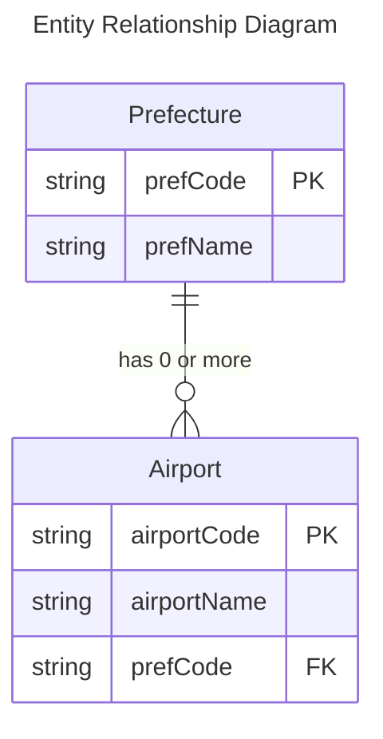

# 第10回課題

最終課題は本課題の成果物をベースに作成予定

## 1. アプリケーション概要

- 取扱データテーブルに対するCRUD処理すべてを備えたREST API

- アプリケーション概略図
  
  

- JUnitによるテストコード実装
- CIの実装
    - [Checkstyle](https://github.com/raisetech-for-student/checkstyle-hands-on)
    
      
      
    - [Codecov](https://github.com/codecov/example-java-gradle)

      
      
      
      
    - [テストレポート可視化(action-junit-report)](https://github.com/mikepenz/action-junit-report)
      
      
            
    - [SpotBugs](https://github.com/spotbugs/spotbugs-gradle-plugin)
    - [Slack Integration](https://github.blog/changelog/2022-12-06-github-actions-workflow-notifications-in-slack-and-microsoft-teams/)
      
      


- GitHub Actionsによる自動単体テスト
  
    - [自動テストコード](https://github.com/SUZUKI-Takayuki-0404/Kadai10th/blob/Update-Readme/.github/workflows/kadai10thtest.yml)
    
    - [実行結果の例](https://github.com/SUZUKI-Takayuki-0404/Kadai10th/actions/runs/4274337865/jobs/7440876285)
  

## 2. 取扱データテーブル

#### 都道府県コード表

[都道府県コード](https://github.com/SUZUKI-Takayuki-0404/Kadai10th/blob/main/sql/table-prefecture.sql)


※01～09を使用の為、都道府県コードは文字列として定義

#### 空港コード表

[空港コード](https://github.com/SUZUKI-Takayuki-0404/Kadai10th/blob/main/sql/table-airport.sql)


#### データテーブルのER図



#### 関連処置：日本語の文字化け対策

- 文字化けの例

  

- 処置（文字エンコード指定）

  


## 3. 各クラスの実装メソッド/Testメソッド確認事項一覧

<details>
<summary>進捗にあわせ更新予定</summary>

### Mapperクラス

#### Prefectures

|Method<br>`type name(arguments)`|Function<br>`実行SQLコマンド`|Testメソッド確認事項|
|--|--|--|
|`Optional<PrefEntity>`<br>`findByCodeFromPrefs(String prefCode)`|指定した都道府県コードに対応する都道府県データを取得する<br>`SELECT * FROM prefectures`<br>`WHERE prefCode = #{prefCode}`|<ul><li>指定の都道府県コードが存在するときは、対応する都道府県EntityをOptionalとして返すこと</li><li>指定の都道府県コードが無いときは、空のOptionalを返すこと</li></ul>|
|`Optional<PrefEntity>`<br>`findByNameFromPrefs(String prefName)`|指定した都道府県名に対応する都道府県データを取得する<br>`SELECT * FROM prefectures`<br>`WHERE prefName = #{prefName}`|<ul><li>指定の都道府県名が存在するときは、対応する都道府県EntityをOptionalとして返すこと</li><li>指定の都道府県名が無いときは、空のOptionalを返すこと</li></ul>|
|`List<PrefEntity> findAllFromPrefs()`|全ての都道府県データを取得する<br>`SELECT * FROM prefectures`|<ul><li>存在する都道府県データ全てをListとして返すこと</li><li>都道府県データが存在しないときは空のListを返すこと</li></ul>|
|`void insertPref`<br>`(String prefCode, String prefName)`|既存と重複しない都道府県データを挿入する<br>`INSERT INTO prefectures (prefCode, prefName)`<br>`VALUES (#{prefCode}, #{prefName})`|<ul><li>指定の都道府県コードが既存のものと重複しない場合は、併せて指定した都道府県名と共にデータ登録すること</li><li>指定の都道府県コードが既存のものと重複する場合は、DuplicateKeyExceptionをスローすること</li></ul>|
|`boolean updatePref`<br>`(String prefCode, String prefName)`|指定した都道府県コードに対応する都道府県データを更新する<br>`UPDATE prefectures `<br>`SET prefName = #{prefName}`<br>`WHERE prefCode = #{prefCode}`|<ul><li>指定の都道府県コードが存在するときは、併せて指定した都道府県名でデータ更新すること</li><li>指定の都道府県コードが存在しない場合は何も変更しないこと</li></ul>|
|`boolean deletePref`<br>`(String prefCode)`|指定した都道府県コードに対応する都道府県のデータを削除する<br>`DELETE FROM prefectures`<br>`WHERE prefCode = #{prefCode}`|<ul><li>指定の都道府県コードが存在する場合は、対応する都道府県データを削除すること</li><li>指定の都道府県コードが存在しない場合は何も変更しないこと</li></ul>|

#### Airports

|Method<br>`type name(arguments)`|Function<br>`事項SQLコマンド`|Testメソッド確認事項|
|--|--|--|
|`Optional<AirportEntity>`<br>`findByCodeFromAirports(String airportCode)`|空港データと都道府県データとを都道府県コードで結合し、指定した空港コードに該当するデータを取得する<br>`SELECT airports.*, prefectures.prefName`<br>`FROM airports INNER JOIN prefectures`<br>`ON airports.prefCode = prefectures.prefCode`<br>`WHERE airportCode = #{airportCode} `|<ul><li>指定の空港コードが存在するときは、対応する空港EntityをOptionalとして返すこと</li><li>指定の空港コードが無いときは、空のOptionalを返すこと</li></ul>|
|`List<AirportEntity> findByPrefFromAirports`<br>`(String airportCode, String airportName, String prefCode)`|空港データと都道府県データとを都道府県コードで結合し、指定した都道府県名に該当するデータを取得する<br>`SELECT airports.*, prefectures.prefName`<br>`FROM airports INNER JOIN prefectures`<br>`ON airports.prefCode = prefectures.prefCode `<br>`WHERE prefCode = #{prefCode}`|<ul><li>指定の都道府県コードが存在するときは、対応する空港EntityをListとして返すこと</li><li>指定の都道府県コードが無いときは、空のListを返すこと</li></ul>|
|`List<AirportEntity> findAllFromAirports()`|空港データと都道府県データとを都道府県コードで結合し、全データを取得する<br>`SELECT airports.*, prefectures.prefName `<br>`FROM airports INNER JOIN prefectures`<br>`ON airports.prefCode = prefectures.prefCode`|<ul><li>存在する全ての空港EntityをListとして返すこと</li><li>空港が存在しないときは空のListを返すこと</li></ul>|
|`void insertAirport`<br>`(String airportCode, String airportName, String prefCode)`|既存と重複しない空港データを挿入する<br>`INSERT INTO airports (airportCode, airportName, prefCode)`<br>`VALUES (#{airportCode}, #{airportName}, #{prefCode})`|<ul><li>指定の空港コードが既存のものと重複しない場合は、併せて指定した空港名および都道府県コードと共にデータ登録すること</li><li>指定の空港コードが既存のものと重複する場合は、DuplicateKeyExceptionをスローすること</li></ul>|
|`boolean updateAirport`<br>`(String airportCode, String airportName, String prefCode)`|指定した空港コードに対応する空港データを更新する<br>`UPDATE airports `<br>`SET airportName = #{airportName}, prefCode = #{prefCode} `<br>`WHERE airportCode = #{airportCode}`|<ul><li>指定の空港コードが存在するときは、併せて指定した空港名および都道府県コードでデータ更新すること</li><li>指定の空港コードが存在しない場合は何も変更しないこと</li></ul>|
|`boolean deleteAirport`<br>`(String airportCode)`|指定した空港コードに対応する空港データを削除する<br>`DELETE FROM airports `<br>`WHERE airportCode = #{airportCode}`|<ul><li>指定の空港コード、対応する空港データを削除すること</li><li>指定の空港コードが存在しない場合は何も変更しないこと</li></ul>|

### Serviceクラス

#### Prefectures

|Method<br>`type name(arguments)`|Function|Testメソッド確認事項|
|--|--|--|
|`PrefEntity getPrefByCode(String prefCode)`|指定の都道府県コードに対応する都道府県データを返す|<ul><li>指定の都道府県コードに対応する都道府県のEntityがある場合はそれを返すこと</li><li>指定の都道府県コードに対応する都道府県のEntityが存在しない場合はNoResourceExceptionをスローすること</li></ul>|
|`PrefEntity getPrefByName(String prefName)`|指定の都道府県名に対応する都道府県データを返す|<ul><li>指定の都道府県名に対応する都道府県のEntityがある場合はそれを返すこと</li><li>指定の都道府県名に対応する都道府県のEntityが無い場合はNoResourceExceptionをスローすること</li></ul>|
|`List<PrefEntity> getAllPrefs()`|都道府県データ全てをListとして返す|<ul><li>都道府県のEntityが存在する場合はその全てをListで返すこと</li><li>都道府県のEntityが無い場合は空のListを返すこと</li></ul>|
|`PrefEntity createPref`<br>`(String prefCode, String prefName)`|新規の都道府県コードで都道府県データを登録する|<ul><li>指定の都道府県コードが既存のものと重複しない場合は併せて指定した都道府県名で新規の都道府県のEntityを追加すること</li><li>指定の都道府県コードが既存のものと重複する場合はCodeDuplicatedExceptionをスローすること</li></ul>|
|`void updatePref`<br>`(String prefCode, String prefName)`|指定の都道府県コードに対応する都道府県データを更新する|<ul><li>指定の都道府県コードに対応する都道府県のEntityがあり併せて指定した都道府県名が従前とは異なる場合は、都道府県名を併せて指定したものに更新すること</li><li>指定の都道府県コードに対応する都道府県のEntityはあるが併せて指定した都道府県名が従前と同等の場合はSameAsCurrentExceptionをスローすること</li><li>指定の都道府県コードに対応する都道府県のEntityが無い場合はNoResourceExceptionをスローすること</li></ul>|
|`void deletePref`<br>`(String prefCode)`|指定の都道府県コードに対応する都道府県データを削除する<br>※削除対象の都道府県コードを付与されている空港がある場合は削除不可|<ul><li>指定の都道府県コードに対応する都道府県のEntityがあり、かつその都道府県コードをもつ空港が存在しない場合は、都道府県を削除すること</li><li>指定の都道府県コードに対応する都道府県のEntityがあり、かつその都道府県コードをもつ空港が存在する場合は、CodeInUseExceptionをスローすること</li><li>指定の都道府県コードに対応する都道府県のEntityが無い場合はNoResourceExceptionをスローすること</li></ul>|

#### Airports

|Method<br>`type name(arguments)`|Function|Testメソッド確認事項|
|--|--|--|
|`AirportEntity`<br>`getAirport(String airportCode)`|指定の空港コードに対応する空港データを返す<br>※都道府県コードから都道府県名を取得する|<ul><li>指定の空港コードに対応する空港のEntityがある場合はそれを返すこと</li><li>指定の空港コードに対応する空港のEntityが存在しない場合はNoResourceExceptionをスローすること</li></ul>|
|`List<AirportEntity>`<br>`getAirportsByPref(String prefCode)`|指定の都道府県名に対応する空港データ全てをListとして返す<br>※都道府県コードから都道府県名を取得する|<ul><li>指定の都道府県コードに対応する空港のEntityがある場合はその全てをListで返すこと</li><li>指定の都道府県コードに対応する空港のEntityが無い場合は空のListを返すこと</li><li>指定の都道府県コードに対応する都道府県データが存在しない場合はNoResourceExceptionをスローすること</li></ul>|
|`List<AirportEntity>`<br>`getAllAirports()`|空港データ全てをListとして返す<br>※都道府県コードから都道府県名を取得する|<ul><li>空港のEntityが存在する場合はその全てをListで返すこと</li><li>空港のEntityが無い場合は空のListを返すこと</li></ul>|
|`AirportEntity createAirport`<br>`(String airportCode, String airportName, String prefCode)`|新規の空港データを登録する|<ul><li>指定の空港コードが既存のものと重複しない場合は、併せて指定した空港名と都道府県で新規の空港のEntityを追加すること</li><li>指定の空港コードが既存のものと重複する場合はCodeDuplicatedExceptionをスローすること</li><li>指定の都道府県コードに対応する都道府県のEntityが存在しない場合はNoResourceExceptionをスローすること</li></ul>|
|`void updateAirport`<br>`(String airportCode, String airportName, String prefCode)`|指定の空港コードに対応する空港データを更新する|<ul><li>指定の空港コードに対応する空港のEntityがあり、かつ併せて指定した空港名が従前とは異なる場合は（都道府県コードは同等でも可）、空港名と都道府県コードを更新すること</li><li>指定の空港コードに対応する空港のEntityはあるが、併せて指定した空港名が従前と同等の場合は、SameAsCurrentExceptionをスローすること</li><li>指定の都道府県コードに対応する都道府県のEntityが無い場合はNoResourceExceptionをスローすること</li><li>指定の空港コードに対応する空港のEntityが存在しない場合はNoResourceExceptionをスローすること</li></ul>|
|`void deleteAirport`<br>`(String airportCode)`|指定の空港コードに対応する空港データを削除する|<ul><li>指定の空港コードに対応する空港のEntityがある場合は削除すること</li><li>指定の空港コードに対応する空港のEntityが無い場合はNoResourceExceptionをスローすること</li></ul>|

### Controllerクラス

#### Prefectures

|Method<br>`type name(arguments)`|Function|Testメソッド確認事項|
|--|--|--|
|`ResponseEntity<PrefResponse>`<br>`getPrefByCode(String prefCode)`|指定した既存の都道府県コードに対応する都道府県データを返す|各場合に対応するステータスコードを返すこと<ul><li>指定した都道府県コードに対応する都道府県データを取得できた場合 **200**</li><li>指定した都道府県コードに対応する都道府県データが存在しなかった場合 **404**</li></ul>|
|`ResponseEntity<PrefResponse>`<br>`getPrefByName(String prefName)`|指定した都道府県名に対応する都道府県データを返す|各場合に対応するステータスコードを返すこと<ul><li>指定した都道府県名に対応する都道府県データを取得できた場合 **200**</li><li>指定した都道府県名に対応する都道府県データが存在しなかった場合 **404**</li></ul>|
|`ResponseEntity<PrefResponse>`<br>`getAllPrefs()`|既存の都道府県コードと対応する都道府県データを全て返す|以下ステータスコードを返すこと<ul><li>**200**</li></ul>|
|`ResponseEntity<PrefResponse>`<br>`createPref(PrefRequestForm prefRequestForm)`|新規の都道府県コードとその都道府県名をデータとして追加する|各場合に対応するステータスコードを返すこと<ul><li>指定した都道府県コードに対応する新規の都道府県データを追加できた場合 **201**</li><li>指定した都道府県コードに対応する新規の都道府県データを追加できなかった場合 **409**</li></ul>|
|`ResponseEntity<Void>`<br>`updatePref(PrefRequestForm prefRequestForm)`|指定した既存の都道府県コードに対応する都道府県名を更新する|各場合に対応するステータスコードを返すこと<ul><li>指定した都道府県コードに対応する都道府県データを更新できた場合 **204**</li><li>指定した都道府県コードに対応する新規の都道府県データを更新できなかった場合 **409**</li><li>指定した都道府県コードに対応する都道府県データが存在しなかった場合 **404**</li></ul>|
|`ResponseEntity<Void>`<br>`deletePref(String prefCode)`|指定した既存の都道府県コードに対応する都道府県データ削除する|各場合に対応するステータスコードを返すこと<ul><li>指定した都道府県コードに対応する都道府県データを削除できた場合 **204**</li><li>指定した都道府県コードに対応する都道府県データを削除できなかった場合 **409**</li><li>指定した都道府県コードに対応する都道府県データが存在しなかった場合 **404**</li></ul>|

#### Airports

|Method<br>`type name(arguments)`|Function|Testメソッド確認事項|
|--|--|--|
|`ResponseEntity<AirportResponse>`<br>`getAirport(String airportCode)`|指定した空港コードに対応する空港データを返す|各場合に対応するステータスコードを返すこと<ul><li>指定した空港コードに対応する空港データを取得できた場合 **200**</li><li>指定した空港コードに対応する空港データが存在しなかった場合 **404**</li></ul>|
|`ResponseEntity<AirportResponse>`<br>`getAirportsInPref(String prefCode)`|指定した都道府県コードに存在する空港データを全て返す|各場合に対応するステータスコードを返すこと<ul><li>指定した都道府県コードに対応する空港データを取得できた場合 **200**</li><li>指定した都道府県コードに対応する空港データが存在しなかった場合 **404**</li></ul>|
|`ResponseEntity<AirportResponse>`<br>`getAllAirports()`|既存の全ての空港データを返す|以下ステータスコードを返すこと<ul><li>**200**</li></ul>|
|`ResponseEntity<AirportResponse>`<br>`createAirport(AirportfRequestForm airportRequestForm)`|新規の空港コードで空港データを新規追加する|各場合に対応するステータスコードを返すこと<ul><li>指定した空港コードに対応する新規の空港データを追加できた場合 **201**</li><li>指定した空港コードに対応する新規の都道府県データを追加できなかった場合 **409**</li><li>指定した都道府県コードに対応する都道府県データが存在しなかった場合 **404**</li></ul>|
|`ResponseEntity<Void>`<br>`updateAirport(AirportfRequestForm airportRequestForm)`|指定の空港コードに対応する空港名、都道府県コードを更新する|各場合に対応するステータスコードを返すこと<ul><li>指定した空港コードに対応する空港データを更新できた場合 **204**</li><li>指定した空港コードに対応する空港データを更新できなかった場合 **409**</li><li>指定した都道府県コードに対応する都道府県データが存在しなかった場合 **404**</li><li>指定した空港コードに対応する空港データが存在しなかった場合 **404**</li></ul>|
|`ResponseEntity<Void>`<br>`deleteAirport(String airportCode)`|指定の空港コードに対応する空港データを削除する|各場合に対応するステータスコードを返すこと<ul><li>指定した空港コードに対応する都道府県データを削除できた場合 **204**</li><li>指定した空港コードに対応する空港データが存在しなかった場合 **404**</li></ul>|

</details>

## 4. API動作確認プロセス

### 事前準備

git clone コマンドにて各自PCにダウンロードし実行<br>

```
git clone https://github.com/SUZUKI-Takayuki-0404/Kadai10th.git
```

### API仕様書

[API仕様書リンク](http://htmlpreview.github.io/?https://github.com/SUZUKI-Takayuki-0404/Kadai10th/blob/Update-Readme/Kadai10api.html)

- [Apiaryエディタ](https://docs.oracle.com/cd/E91812_01/tools/apiary-editor/index.html)を使用し、API Blueprintにて作成<br>
  <br>
  
- 上記で作成した仕様書を[aglio](https://github.com/danielgtaylor/aglio)にてhtml変換<br>
  使用コマンド(例)：
  ```
  aglio -i kadai10api.apib -o Kadai10api.html
  ```
- GitHub上のhtmlファイル表示には[GitHub & BitBucket HTML Preview](https://htmlpreview.github.io/)を使用
  <br>

### curlコマンド一覧

#### Prefectures

※2023/1/30時点では未実装

| Request | curlコマンド |
|--|--|
| GET | `curl 'http://localhost:8080/prefectures/01'` |
| GET | `curl 'http://localhost:8080/prefectures/?prefName=北海道'` |
| GET | `curl 'http://localhost:8080/prefectures'` |
| POST| `curl -XPOST -H "Content-type: application/json" -d '{"prefCode": "11","prefName": "さいたま県"}' 'http://localhost:8080/prefectures'` |
| PATCH| `curl -XPATCH -H "Content-type: application/json" -d '{"prefCode": "11","prefName": "埼玉県"}' 'http://localhost:8080/prefectures'` |
| DELETE | `curl -XDELETE 'http://localhost:8080/prefectures/11'` |

#### Airports

| Request | curlコマンド |
|--|--|
| GET | `curl 'http://localhost:8080/airports/NKM'` |
| GET | `curl 'http://localhost:8080/airports/prefectures/13'` |
| GET | `curl 'http://localhost:8080/airports'` |
| POST | `curl -XPOST -H "Content-type: application/json" -d '{ "airportCode" : "IRM", "airportName": "入間", "prefCode": "11" }' 'http://localhost:8080/airports/'` |
| PATCH | `curl -XPATCH -H "Content-type: application/json" -d '{"airportCode": "NKM", "airportName": "名古屋", "prefCode": "23"}' 'http://localhost:8080/airports/NKM'` |
| DELETE | `curl -XDELETE 'http://localhost:8080/airports/IRM'` |

**＜補足＞**  WindowsパソコンでPoweshell（含：IntelliJのターミナル）またはコマンドプロンプト使用時の注意事項

* json形式データ入力時に`"`の前に`\`が必要<br>
  `-d '{ "airportCode": "MYE", "airportName": "Miyakejima", "airportCode": "13" }`<br>
  ⇒ `-d '{ \"airportCode\": \"MYE\", \"airportName\": \"Miyakejima\", \"airportCode\": \"13\" }`

* json形式データ内に日本語入力は不可<br>
  Ubuntu(Linux)を代用すれば入力可能だが、WSLとWindowsではlocalhostが異なるため、localhostから書き換えが必要<br>
  ⇒ `'http://172.18.16.x:8080/prefectures/?prefCode=01'` (IPアドレスは`ipconfig`で確認)
